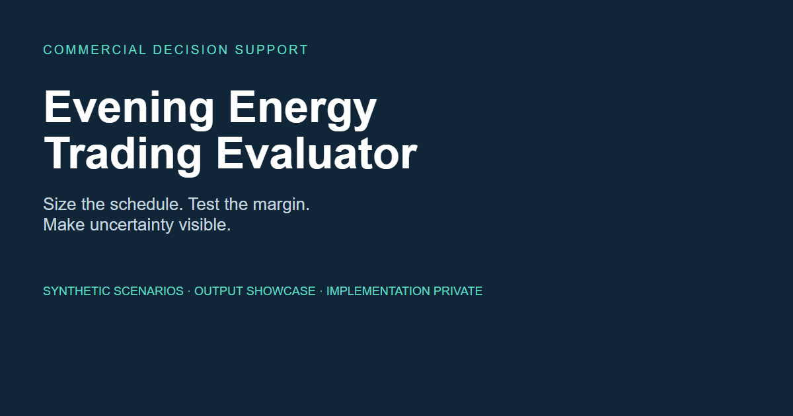
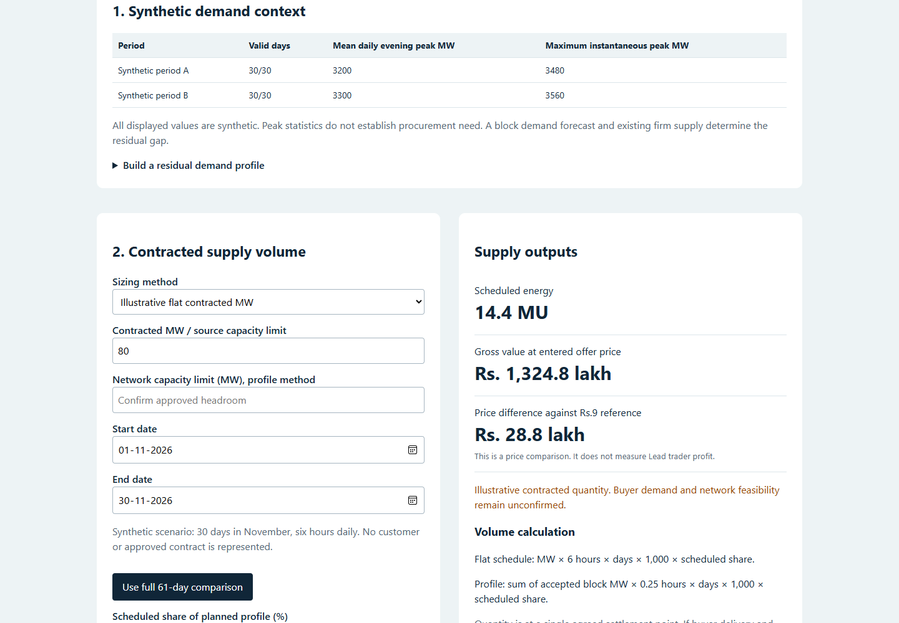
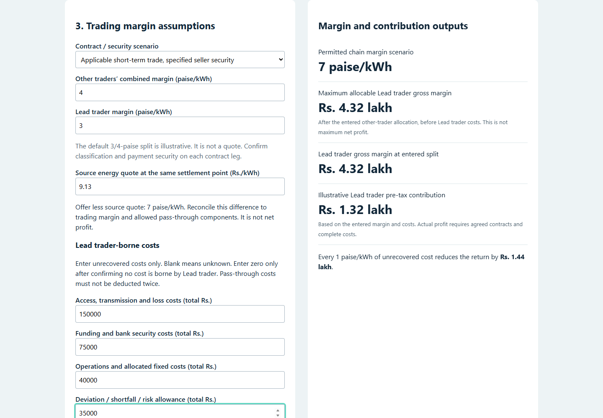
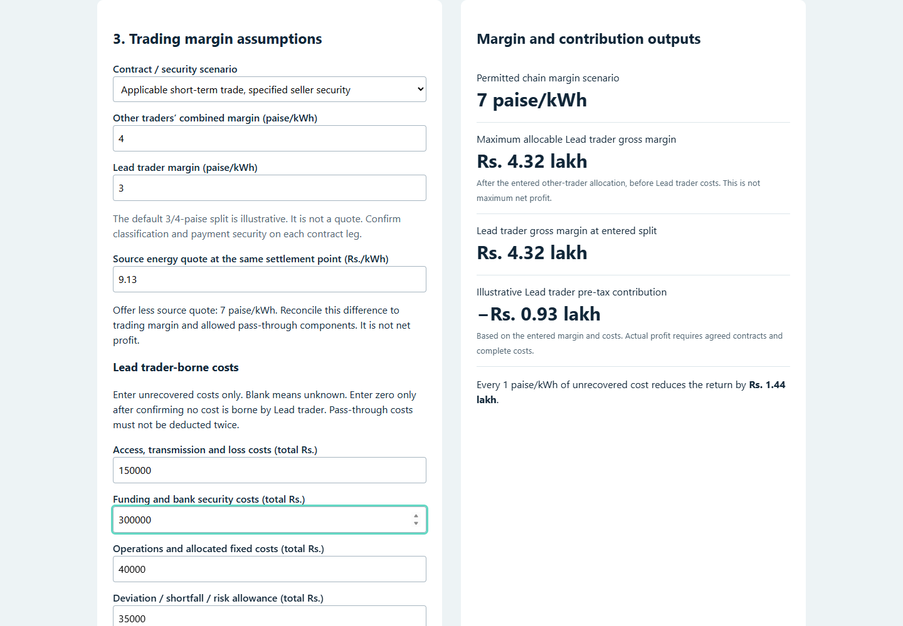
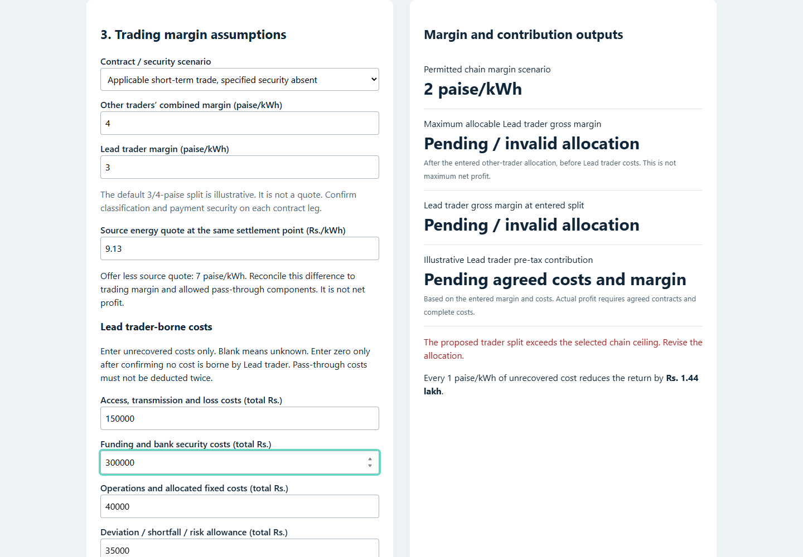
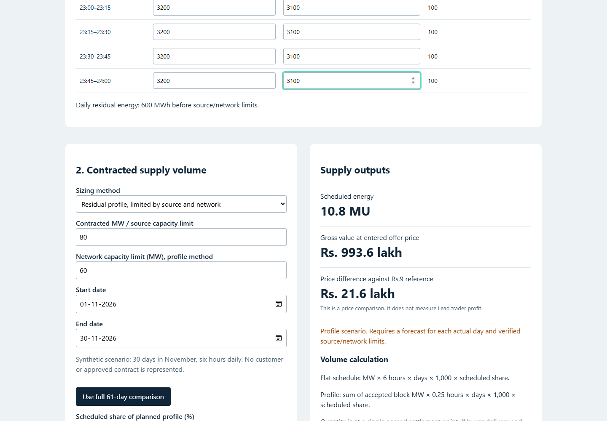
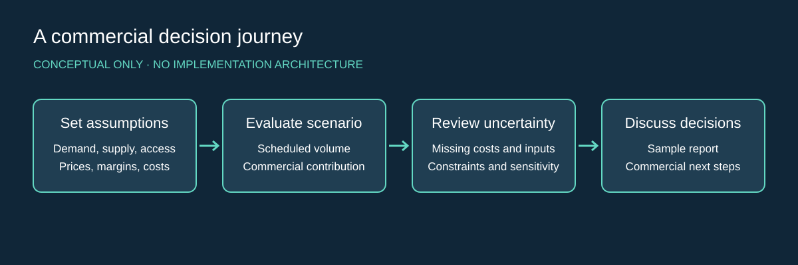

# Evening Energy Trading Evaluator

> **Notice**  
> This repository is a public project showcase created using NebulaCloud Studio.  
> The proprietary source code, implementation details, prompts, workflows, datasets, infrastructure, and deployment configuration are intentionally not included.

## Overview
An output-focused showcase of a commercial decision tool for evening power procurement. It makes scheduled energy, trader margins, unrecovered costs and uncertainty visible in one evaluation. Every public example uses synthetic values.

## Business Problem
A headline power price does not reveal trader profit. Commercial teams must distinguish procurement need from total demand, respect supply and network constraints, allocate margins, and account for costs before discussing a transaction.

## Solution Overview
The evaluator compares flat schedules and residual block profiles, calculates energy and illustrative contribution, and flags incomplete assumptions or invalid margin allocations. The showcase presents the resulting user experience and decision outputs.

## Live Demo
[Open the hosted demonstration video](https://studio-public-demos.github.io/evening-energy-trading-showcase/assets/videos/walkthrough.webm). This is a recorded demonstration of the working evaluator using synthetic data. There is no public interactive calculator; its implementation remains private.

## Demo Video
[Watch the walkthrough](assets/videos/walkthrough.webm): schedule sizing, contribution, funding-cost sensitivity, allocation validation and a network-limited profile. On-screen captions explain each example; the recording has no narration.

## Project Screenshots

[View the mobile layout](assets/screenshots/06-mobile.png). Screenshots come from the working evaluator with synthetic inputs; they are not concept mockups.

## Generated Outputs
- [Synthetic commercial summary PDF](assets/outputs/synthetic-commercial-summary.pdf)
- [Synthetic scenario comparison CSV](assets/outputs/synthetic-scenario-results.csv)

The baseline example schedules 14.4 MU. A 3-paise lead-trader allocation yields Rs.4.32 lakh gross margin; Rs.3 lakh of entered costs leaves Rs.1.32 lakh illustrative pre-tax contribution. These are demonstration arithmetic, not a live quote or an expected return.

## Key Features
- Flat and 15-minute residual-profile quantity calculations.
- Source and network capacity limits for profile scenarios.
- Gross energy value separated from trader contribution.
- Selected chain-margin allocation checks.
- Explicit missing-input states and negative contribution results.
- Conditional access-fee scenarios and a print/save workflow.

## Intended Users
Power trading commercial teams, utility procurement analysts, finance reviewers and business-development teams.

## Example Use Cases
Compare a proposed schedule with network headroom; examine funding-cost exposure; identify missing inputs before a term-sheet discussion; communicate a scenario to commercial reviewers.

## Technical Highlights (High-Level Only)
Browser-based scenario evaluation, responsive input forms, immediate calculated outputs and printable summaries. The public package contains documentation, rendered media and synthetic result files only.

## Architecture Overview (Conceptual Only)

Users enter assumptions, examine scenario outputs, review uncertainty and discuss next steps. This diagram describes the user journey and contains no internal implementation architecture.

## Technical Scope & Limitations
The tool evaluates entered assumptions. It does not forecast demand, guarantee access, execute trades, verify licence status or establish maximum net profit. A repeated daily profile is a scenario, not a day-specific forecast. Legal applicability, current tariffs and contract terms require separate confirmation. Public assets contain no customer data or historical source extracts. No production reliability or performance benchmark is claimed.

## Performance Summary (Verified Only)
Functional checks on the captured synthetic scenarios verified:

| Check | Verified result |
|---|---|
| 80 MW × 6 hours × 30 days | 14.4 MU |
| Lead-trader margin at 3 paise/kWh | Rs.4.32 lakh gross |
| Contribution after Rs.3 lakh entered costs | Rs.1.32 lakh |
| 100 MW residual gap, 60 MW network limit | 10.8 MU |
| Allocation exceeds selected ceiling | Warning; contribution withheld |
| Desktop and mobile browser checks | No uncaught page errors; no mobile page overflow |

These checks establish scenario behavior, not speed, business outcomes or transaction feasibility.

## Attribution
See [ATTRIBUTIONS.md](ATTRIBUTIONS.md). No third-party photographs, logos or datasets are redistributed. Public scenario values are synthetic.

## Built with NebulaCloud Studio
Prepared for the [NebulaCloud Studio public portfolio](https://studio-public-demos.github.io/). Explore [NebulaCloud Studio](https://nebulacloud.studio/) and its [project showcases](https://github.com/studio-public-demos).

## Related Project Showcases
Explore the [public showcase catalogue](https://studio-public-demos.github.io/) for further examples.

## Call to Action
Request a private demonstration or a tailored commercial evaluator through [NebulaCloud Studio](https://nebulacloud.studio/). Bring your proposed delivery period, buyer profile, source availability and commercial assumptions to scope the discussion.
